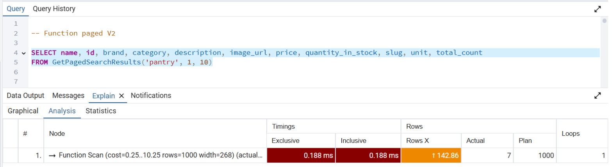
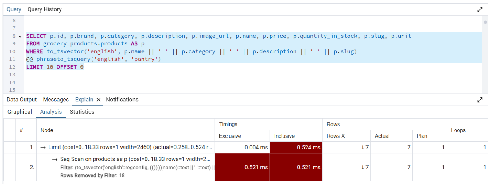
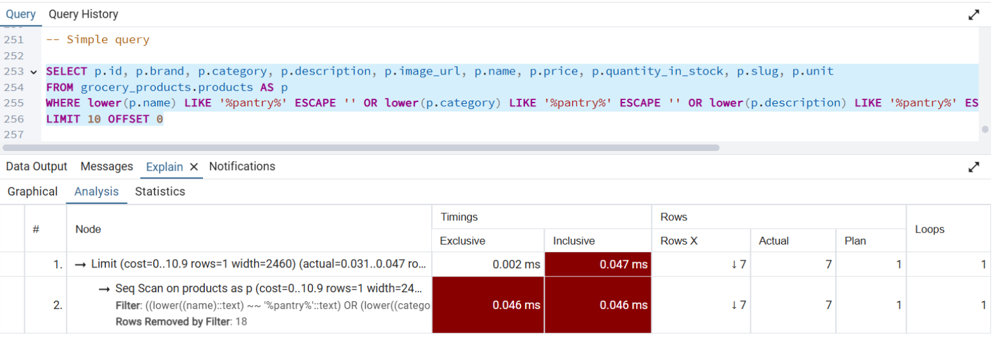

# PostgreSQL Labs
## Introduction  

A series of labs presented in this document demonstrate PostgreSQL functionalities and their integration with a .NET application for REST API development. The labs will introduce concepts like:  
### SQL Related Topics
- SQL Functions
	- Develop SQL functions to manage data retrieval and manipulation with pagination and search capabilities. 
- Full-Text Search
	- Develop full-text search functionality with PostgreSQL's native features.
- SQL Simple Case-Insensitive Search
	- Develop case-insensitive search capabilities and utilize operators like `ILIKE` to achieve case-insensitive matching.


## Goals  

By completing these labs, you will:
- **Gain hands-on experience** with PostgreSQL, learning how to effectively fetch and index data using its powerful features.
- **Sharpen your SQL skills** through practical application and real-world scenarios.
- **Develop a strong understanding** of API versioning and best practices for robust error handling.


## 1 SQL Function paged search with total count

```sql
CREATE OR REPLACE FUNCTION GetPagedSearchResults (
    IN SearchTerm TEXT,
    IN PageNumber INT,
    IN PageSize INT
)
RETURNS TABLE (
    name TEXT,
    id INT,
    brand TEXT,
    category TEXT,
    description TEXT,
    image_url TEXT,
    price NUMERIC,
    quantity_in_stock INT,
    slug TEXT,
    unit TEXT,
    total_count INT -- Total count of matching records
) 
LANGUAGE plpgsql
AS $$
DECLARE
    OffsetValue INT;
BEGIN
    OffsetValue := (PageNumber - 1) * PageSize;

    RETURN QUERY
    SELECT 
        p.name::TEXT,  
        p.id,
        p.brand::TEXT,  
        p.category::TEXT,  
        COALESCE(p.description, '')::TEXT,  
        COALESCE(p.image_url, '')::TEXT, 
        p.price,
        p.quantity_in_stock,
        p.slug::TEXT,  
        COALESCE(p.unit, '')::TEXT,
        COUNT(*) OVER()::INT AS total_count 
    FROM grocery_products.products AS p
    WHERE (COALESCE(SearchTerm, '') = '' 
           OR p.name ILIKE '%' || SearchTerm || '%' 
           OR p.category ILIKE '%' || SearchTerm || '%'
           OR p.slug ILIKE '%' || SearchTerm || '%'
           OR (p.description IS NOT NULL AND p.description ILIKE '%' || SearchTerm || '%'))
    ORDER BY p.name
    LIMIT PageSize OFFSET OffsetValue;
END;
$$;
```



## 2 Full-text search with vector column

```sql
SELECT p.id, p.brand, p.category, p.description, p.image_url, p.name, p.price, p.quantity_in_stock, p.slug, p.unit
FROM grocery_products.products AS p
WHERE to_tsvector('english', p.name || ' ' || p.category || ' ' || p.description || ' ' || p.slug) 
@@ phraseto_tsquery('english', 'pantry')
LIMIT 10 OFFSET 0
```



## 3 SQL search with LIKE and with LIKE

```sql
SELECT p.id, p.brand, p.category, p.description, p.image_url, p.name, p.price, p.quantity_in_stock, p.slug, p.unit
FROM grocery_products.products AS p
WHERE lower(p.name) LIKE '%pantry%' ESCAPE '' OR lower(p.category) LIKE '%pantry%' ESCAPE '' OR lower(p.description) LIKE '%pantry%' ESCAPE '' OR lower(p.slug) LIKE '%pantry%' ESCAPE ''
LIMIT 10 OFFSET 0
```




## Resources

- [Full Text Search in .NET With PostgreSQL and EF Core](https://youtu.be/NPduWiPzhpE?si=mH5JHr2O2ASulMuT)
- [Postgres Docs - Chapter 12. Full Text Search](https://www.postgresql.org/docs/current/textsearch.html)
- [sandeep-sachan Why-EF-pagination](https://sandeep-sachan.medium.com/why-entity-framework-pagination-to-stored-procedures-e5b04d63019)

- 
### Future Topics REST Api & SQL
- Join Types 
	- Learn to use various join types in SQL queries to retrieve data more efficiently from multiple tables. 
- API Versioning
	- Approaches for handling data version control inside the database system. 
- Error Handling
	- Develop reliable error handling systems within both SQL queries and the application logic. 
- Distributed Cache (Redis)
	- The application performance benefits from distributed caching through Redis.

## Summary  

Through hands-on labs participants acquire knowledge of PostgreSQL usage and REST API construction with .NET.